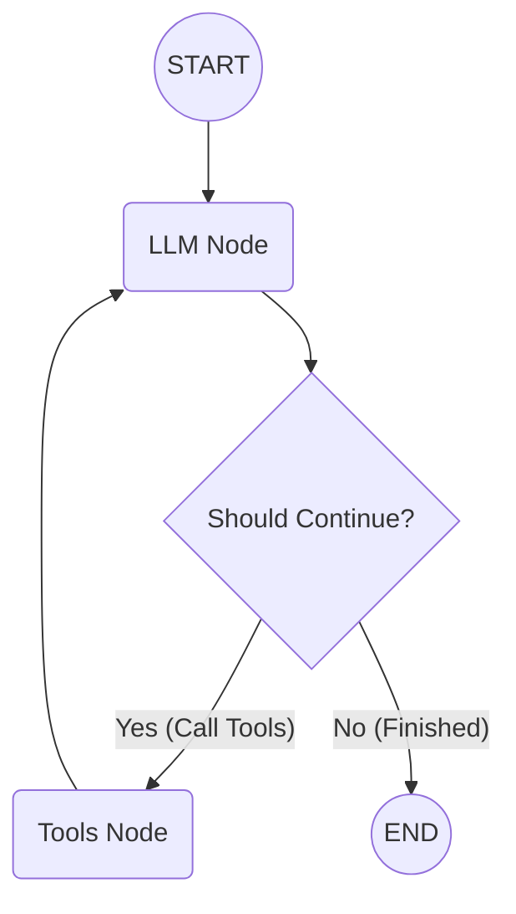

+++
title = "Building a Coding Agent from First Principles (Part 1)"
date = 2026-08-01
slug = "building-coding-agent-part-1"
description = "What exactly is a coding agent? Strip away the hype, and it's just an LLM in a loop with tools. Here is how to construct a ReAct agent using LangGraph."

[taxonomies]
tags = ["ai", "agents", "langgraph", "engineering"]

[extra]
card = "coding-agent-banner.png"
+++


We've all seen the rise of powerful AI coding assistants recently—tools like Claude Code, Codex, and the Pi agent are fundamentally changing how we write software. But under the magic, what exactly *is* a coding agent?

Strip away the hype, the complex sandbox environments, and the advanced context compression algorithms, and you are left with something surprisingly simple: **a coding agent is just an LLM given a set of tools, iterating in a loop until a task is finished.**

Everything else is just optimization.

In this article, we're going back to first principles to understand how to build a basic **ReAct (Reason + Act)** coding agent using **LangGraph**.

---

## Step 1: Defining the Agent's Tools

An LLM on its own can only generate text. To turn it into a coding agent, we must give it functions (tools) that interact with the local filesystem and shell.

Using LangChain's `@tool` decorator, we can define simple Python functions that the LLM can decide to call:

```python
from langchain_core.tools import tool
import os
import subprocess

@tool
def ls(path: str = ".") -> str:
    """Lists files and directories at the given path."""
    try:
        return "\n".join(os.listdir(path))
    except Exception as e:
        return f"Error listing directory: {e}"

@tool
def read(path: str) -> str:
    """Reads the contents of a file."""
    try:
        with open(path, "r", encoding="utf-8") as f:
            return f.read()
    except Exception as e:
        return f"Error reading file: {e}"

@tool
def write(path: str, content: str) -> str:
    """Writes content to a file, overwriting existing file content."""
    try:
        with open(path, "w", encoding="utf-8") as f:
            f.write(content)
        return f"Successfully wrote to {path}"
    except Exception as e:
        return f"Error writing file: {e}"

@tool
def bash(command: str) -> str:
    """Executes a bash command in the terminal."""
    try:
        result = subprocess.run(
            command, shell=True, capture_output=True, text=True, timeout=30
        )
        return result.stdout or result.stderr or "Command executed with no output."
    except Exception as e:
        return f"Execution error: {e}"
```

When these tools are passed to an LLM supporting function calling, the model receives their names, docstrings, and parameter schemas. It uses this information to decide which tool to execute based on the user's prompt.

---

## Step 2: Designing the State Machine with LangGraph

LangGraph allows us to express agentic workflows as a **State Graph**. The graph maintains a state across steps and loops between **Reasoning** (the LLM) and **Acting** (Executing Tools).

Here is the core architecture:



### 1. Defining the Agent State

The state simply keeps track of the message history during the conversation.

```python
from typing import Annotated, Sequence
from typing_extensions import TypedDict
from langchain_core.messages import BaseMessage
from langgraph.graph.message import add_messages

class AgentState(TypedDict):
    messages: Annotated[Sequence[BaseMessage], add_messages]
```

### 2. The LLM Node (Reasoning)

The model receives the full message history, evaluates what needs to be done, and returns a response—which may include tool call requests.

```python
from langchain_openai import ChatOpenAI

tools = [ls, read, write, bash]
model = ChatOpenAI(model="gpt-4o").bind_tools(tools)

def call_model(state: AgentState):
    messages = state["messages"]
    response = model.invoke(messages)
    return {"messages": [response]}
```

### 3. The Conditional Edge (Routing Logic)

After the LLM node runs, we check if the response includes any tool calls.
- If **yes**: route execution to the `Tools Node`.
- If **no**: the model finished answering, so route to `END`.

```python
from langgraph.graph import END

def should_continue(state: AgentState):
    messages = state["messages"]
    last_message = messages[-1]
    
    if last_message.tool_calls:
        return "tools"
    return END
```

### 4. Building and Compiling the Graph

Finally, we assemble the nodes, conditional edges, and tool execution into a compiled graph:

```python
from langgraph.graph import StateGraph, START
from langgraph.prebuilt import ToolNode

# Create the graph
workflow = StateGraph(AgentState)

# Add nodes
workflow.add_node("llm_node", call_model)
workflow.add_node("tools", ToolNode(tools))

# Add edges
workflow.add_edge(START, "llm_node")
workflow.add_conditional_edges("llm_node", should_continue, ["tools", END])
workflow.add_edge("tools", "llm_node")

# Compile the graph
app = workflow.compile()
```

---

## How the Agent Runs

1. The user asks: *"List the files in the directory and read main.py"*.
2. **`llm_node`** executes. The LLM recognizes it needs `ls` and returns a tool call request for `ls(".")`.
3. **`should_continue`** sees `tool_calls`, so it routes to **`tools`**.
4. **`tools`** node executes `ls(".")` and appends a `ToolMessage` with the directory listing to the state.
5. Control returns to **`llm_node`**. The LLM now sees the file list, decides to call `read("main.py")`, and the loop repeats.
6. Once the model has all the info and responds with text without requesting further tool calls, **`should_continue`** routes to `END`.

---

## What's Next?

We've covered the core principle: a coding agent is fundamentally just an LLM bound to tools operating in a state loop.

However, this basic implementation has clear limits:
- What happens when a file read or `grep` output exceeds the context window?
- How do we restrict shell commands for safety?
- How do we handle multi-file edits cleanly without hallucinating line numbers?

In **Part 2**, we will explore production optimizations: context compression, output truncation, safer sandboxing, and sub-agent Delegation.

---

### Source Code
You can check out the complete repository and implementation here:  
👉 **<a href="https://github.com/bikaxh01/coding_agent" target="_blank" rel="noopener noreferrer">GitHub: coding_agent</a>**
